<div align="center">
  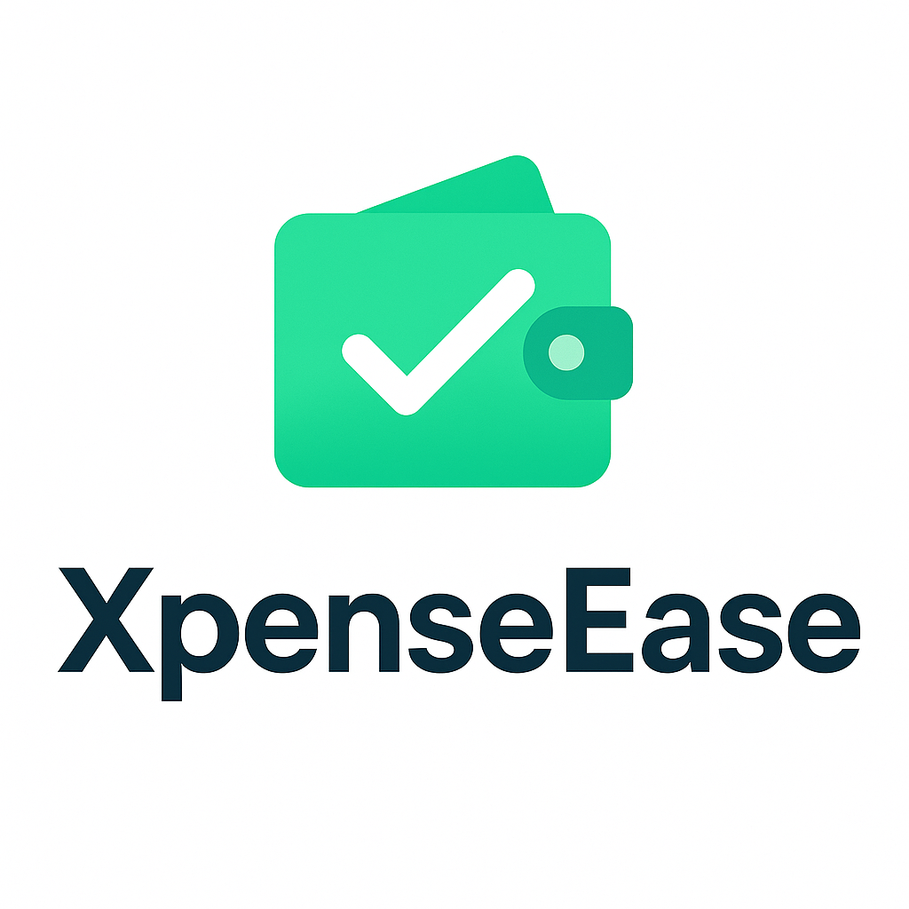
  
  #  XpenseEase
  
  <p><strong>A comprehensive expense tracking mobile application built with React Native and Expo, designed to help students and administrators manage expenses with real-time budget tracking, detailed analytics, and multi-role support.</strong></p>
</div>


## ✨ Features

### 👨‍🎓 For Students
- **📱 Dashboard Overview** - Real-time budget tracking and expense summary
- **💸 Expense Management** - Add, edit, and delete personal expenses
- **📊 Visual Analytics** - Charts and graphs for spending patterns
- **🎯 Budget Setup** - Set and monitor weekly/monthly budgets
- **📈 Detailed Reports** - Comprehensive spending analysis
- **🔄 Expense Categories** - Organized tracking by Food, Transport, School Supplies, Entertainment, etc.
- **👤 Profile Management** - Personal information and settings

### 👨‍💼 For Administrators
- **📋 Student Management** - View and manage student accounts
- **🏫 Course Management** - Add and organize courses and colleges
- **📊 Global Analytics** - System-wide expense tracking and reports
- **⚙️ Expense Oversight** - Monitor and manage all student expenses
- **📈 Administrative Reports** - Comprehensive system analytics

## 🛠️ Technology Stack

- **Frontend**: React Native with Expo
- **Backend**: Firebase Firestore
- **Authentication**: Firebase Auth
- **Charts**: react-native-chart-kit
- **Navigation**: React Navigation 6
- **State Management**: React Context API
- **Image Handling**: Expo Image Picker
- **Icons**: Expo Vector Icons

## 📸 Screenshots

### Student Interface

<div align="center">

#### Dashboard & Home Screen
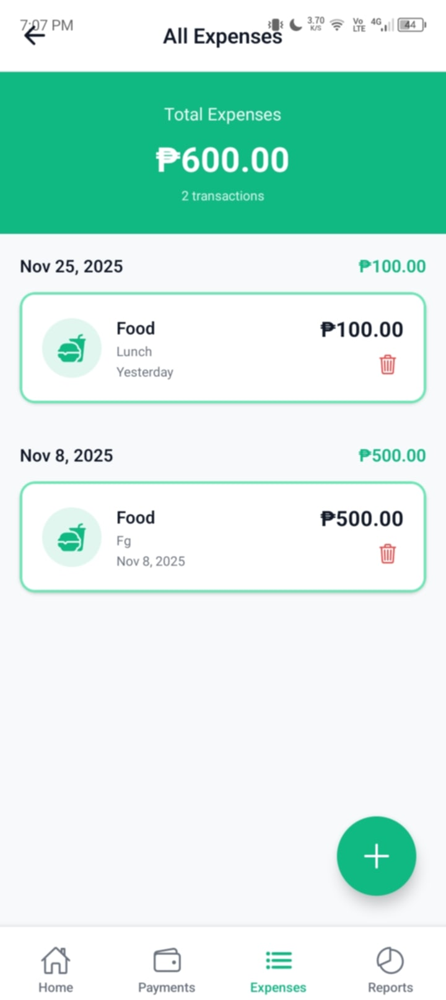

*Main dashboard showing budget overview, recent expenses, and quick actions*

#### Expense Management
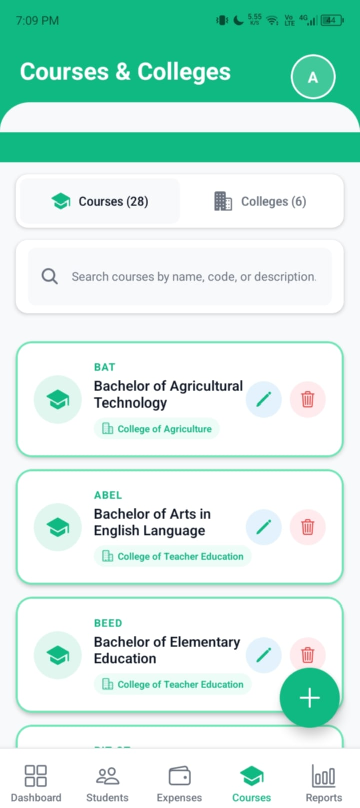 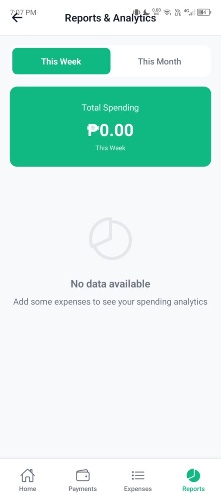

*Add new expenses with categories and view detailed expense history*

#### Reports & Analytics
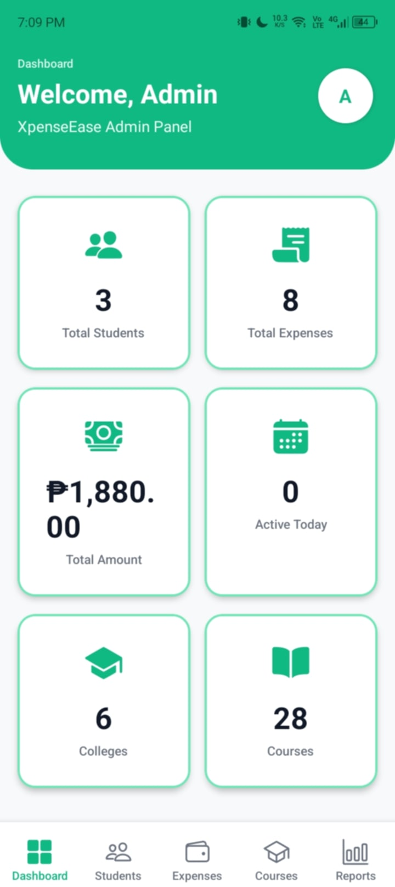

*Visual charts showing spending patterns and budget analysis*

#### Profile Management
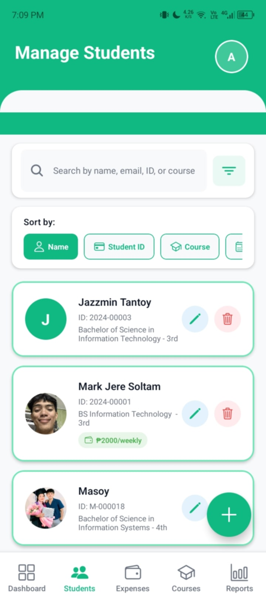

*User profile with personal information and settings*

### Admin Interface

#### Admin Dashboard
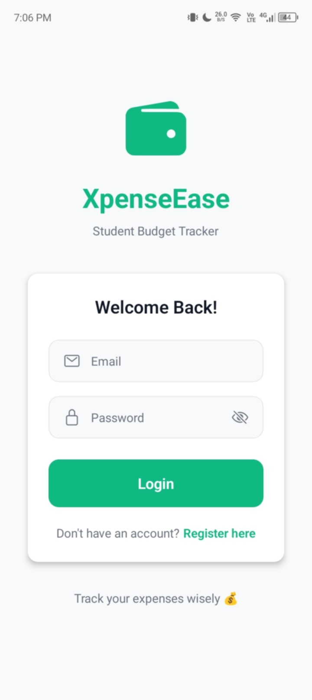

*Administrative overview with system-wide statistics*

#### Student Management
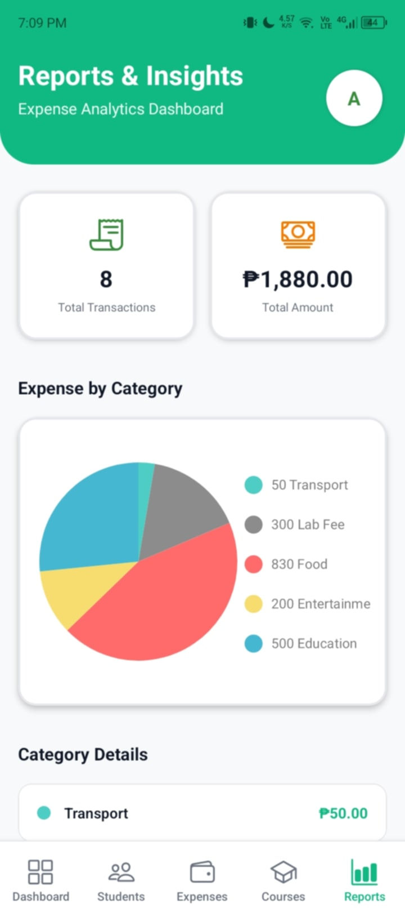

*View and manage all student accounts*

#### Course Management
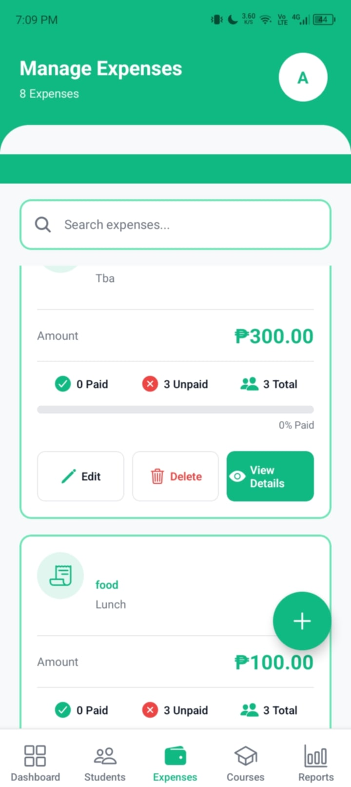

*Add and organize courses and colleges*

### Authentication
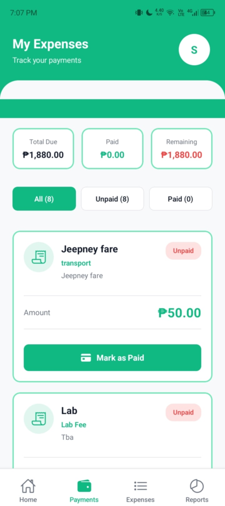 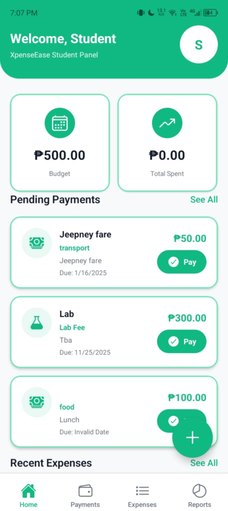

*Secure login and registration screens*

</div>

## 🚀 Quick Start

### Prerequisites
- Node.js (v14 or higher)
- npm or yarn
- Expo CLI
- Firebase project setup

### Installation

1. **Clone the repository**
```bash
git clone https://github.com/yourusername/xpenseease.git
cd xpenseease
```

2. **Install dependencies**
```bash
npm install
```

3. **Firebase Setup**
   - Create a new Firebase project
   - Enable Firestore Database
   - Enable Authentication
   - Add your Firebase configuration to `config/firebase.config.js`

4. **Start the development server**
```bash
npm start
```

5. **Run on device**
   - Install Expo Go app on your mobile device
   - Scan the QR code displayed in terminal
   - Or run on emulator: `npm run android` / `npm run ios`

## 📱 Usage

### For Students:
1. **Register/Login** - Create an account or login with existing credentials
2. **Setup Budget** - Set your weekly/monthly spending limits
3. **Add Expenses** - Record expenses with categories and amounts
4. **Monitor Progress** - Track spending against budget in real-time
5. **View Reports** - Analyze spending patterns with visual charts

### For Administrators:
1. **Login** - Access admin panel with administrative credentials
2. **Manage Students** - View and oversee all student accounts
3. **System Analytics** - Monitor system-wide expense trends
4. **Course Management** - Add and organize educational institutions
5. **Generate Reports** - Create comprehensive system reports

## 🔧 Configuration

### Environment Variables
Create a `.env` file in the root directory:
```
EXPO_PUBLIC_API_URL=your_api_url_here
EXPO_PUBLIC_FIREBASE_API_KEY=your_firebase_api_key
EXPO_PUBLIC_FIREBASE_PROJECT_ID=your_project_id
```

### Firebase Configuration
Update `config/firebase.config.js` with your Firebase project credentials:
```javascript
const firebaseConfig = {
  apiKey: "your-api-key",
  authDomain: "your-project.firebaseapp.com",
  projectId: "your-project-id",
  // ... other config
};
```

## 📦 Project Structure

```
XpenseEase/
├── App.js                     # Main app entry point
├── app.json                   # Expo configuration
├── package.json               # Dependencies
├── babel.config.js            # Babel configuration
├── eas.json                   # EAS Build configuration
├── assets/                    # Static assets
│   ├── fonts/                 # Custom fonts
│   └── images/                # App images
├── config/                    # Configuration files
│   └── firebase.config.js     # Firebase setup
├── src/
│   ├── components/            # Reusable UI components
│   │   ├── BudgetProgressBar.js
│   │   ├── Button.js
│   │   ├── CategoryPicker.js
│   │   └── ExpenseCard.js
│   ├── constants/             # App constants
│   │   ├── categories.js      # Expense categories
│   │   └── theme.js          # Colors and styles
│   ├── context/              # React Context
│   │   └── UserContext.js    # User state management
│   ├── navigation/           # Navigation setup
│   │   └── AppNavigator.js   # Main navigator
│   ├── screens/              # Application screens
│   │   ├── Admin/           # Admin-only screens
│   │   ├── Auth/            # Authentication screens
│   │   └── Student/         # Student screens
│   ├── services/            # Business logic
│   │   ├── authService.js   # Authentication
│   │   ├── firestoreService.js # Database operations
│   │   └── profileService.js   # Profile management
│   └── utils/               # Utility functions
│       └── helpers.js       # Helper functions
└── scripts/                 # Setup scripts
    ├── setupFirestore.js    # Database initialization
    └── createInitialAccounts.js # Demo data
```

## 🎨 Design System

### Color Palette
- **Primary**: #10B981 (Green)
- **Secondary**: #6EE7B7 (Light Green)
- **Accent**: #059669 (Dark Green)
- **Background**: #F9FAFB (Light Gray)
- **Text**: #1F2937 (Dark Gray)
- **Error**: #EF4444 (Red)

### Typography
- **Headings**: System font, bold
- **Body**: System font, regular
- **Captions**: System font, light

## 🔐 Security Features

- **Firebase Authentication** - Secure user authentication
- **Role-based Access** - Different permissions for students and admins
- **Data Validation** - Input validation and sanitization
- **Secure Storage** - Encrypted local storage for sensitive data

## 🧪 Testing

```bash
# Run tests
npm test

# Run tests with coverage
npm run test:coverage

# Run E2E tests
npm run test:e2e
```

## 📈 Performance Optimization

- **Lazy Loading** - Components loaded on demand
- **Image Optimization** - Compressed images and caching
- **Data Pagination** - Efficient data loading
- **Memory Management** - Proper cleanup of resources

## 🚀 Deployment

### Building for Production

1. **Android APK**
```bash
eas build --platform android
```

2. **iOS IPA**
```bash
eas build --platform ios
```

3. **App Store Deployment**
```bash
eas submit --platform ios
```

4. **Google Play Store**
```bash
eas submit --platform android
```

## 🤝 Contributing

1. Fork the repository
2. Create a feature branch (`git checkout -b feature/AmazingFeature`)
3. Commit your changes (`git commit -m 'Add some AmazingFeature'`)
4. Push to the branch (`git push origin feature/AmazingFeature`)
5. Open a Pull Request

### Development Guidelines
- Follow React Native best practices
- Write meaningful commit messages
- Add tests for new features
- Update documentation as needed
- Use ESLint and Prettier for code formatting

## 📝 License

This project is licensed under the MIT License - see the [LICENSE](LICENSE) file for details.

## 🙋‍♂️ Support

If you have any questions or need help:

- 📧 Email: support@xpenseease.com
- 🐛 Issues: [GitHub Issues](https://github.com/yourusername/xpenseease/issues)
- 📖 Documentation: [Wiki](https://github.com/yourusername/xpenseease/wiki)

## 🎯 Roadmap

### Upcoming Features
- [ ] **Dark Mode** - Theme switching capability
- [ ] **Export Data** - CSV/PDF export functionality
- [ ] **Notifications** - Budget alerts and reminders
- [ ] **Multi-language** - Internationalization support
- [ ] **Offline Mode** - Offline data synchronization
- [ ] **Receipt Scanning** - OCR for receipt processing
- [ ] **Shared Expenses** - Group expense tracking
- [ ] **Investment Tracking** - Portfolio management

### Version History
- **v1.0.0** - Initial release with core expense tracking
- **v1.1.0** - Admin panel and course management
- **v1.2.0** - Enhanced analytics and reporting
- **v2.0.0** - Complete UI overhaul and new features (Coming Soon)

## 👨‍💻 About the Developer

<div align="center">
  
  
  **Mark Jere Soltam Ayala Gementiza**
  
  *23 years old • BSIT Student*
  
  🎓 **Agusan del Sur State College of Agriculture and Technology**
  
  <p>Passionate about mobile app development and creating solutions that help students manage their finances effectively. This project represents my journey in React Native development and my commitment to building practical applications for the student community.</p>
</div>

## 🏆 Acknowledgments

- React Native team for the amazing framework
- Expo team for simplifying development
- Firebase for backend services
- Chart.js community for visualization components
- All contributors who helped make this project better

---

<div align="center">
  <p>Made with ❤️ by <strong>Mark Jere Soltam Ayala Gementiza</strong></p>
  <p>BSIT Student • Agusan del Sur State College of Agriculture and Technology</p>
  <p>⭐ Star us on GitHub if this project helped you!</p>
</div>